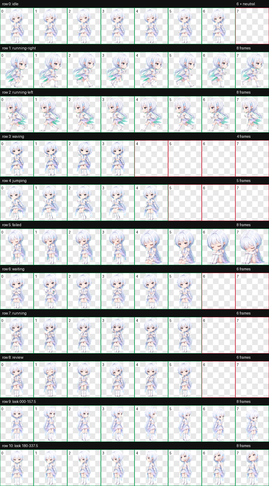

# CodexPet SALA

SALAをCodexデスクトップ向けのちびキャラペットにした、CodexPet v2パッケージです。

> [!IMPORTANT]
> **個人・非商用でのインストールのみ許可されています。再配布不可です。** 再配布、転載、再アップロード、ミラー、同梱配布、販売、商用利用、素材の抜き出し利用、改変版・派生物の作成または配布は禁止されています。詳細は[個人利用ライセンス](LICENSE.md)を確認してください。



## 日本語

### 特徴

- 銀白色の髪、青灰色の瞳、ヘッドセット、青い胸部コアを保った約2.5頭身のデザイン
- 通常アニメーション9種と、時計回り16方向の視線アニメーション
- `192 × 208` pxのセルを`8 × 11`に配置した、`1536 × 2288` pxの透過WebP
- `spriteVersionNumber: 2`対応
- フレーム構造、透過、方向、連続性を検証済み

### インストール

PowerShell:

```powershell
.\scripts\install.ps1
```

macOS / Linux:

```bash
./scripts/install.sh
```

手動の場合は、[`pet`](pet)内の2ファイルをCodexのローカルペットディレクトリへコピーします。

```text
<CODEX_HOME>/pets/sala/
├── pet.json
└── spritesheet.webp
```

`CODEX_HOME`を設定していない一般的な環境では、ホームディレクトリ配下の`.codex`が使われます。反映されない場合はCodexを再起動するか、ペット選択画面を開き直してください。

> このカスタムペット形式はCodexデスクトップのローカルパッケージ構成に基づきます。公開APIとして文書化された形式ではないため、将来のアプリ更新で変わる可能性があります。

### ドキュメント

- [インストール詳細](docs/INSTALLATION.md)
- [アニメーション仕様](docs/ANIMATION_SPEC.md)
- [QA・検証結果](docs/QA.md)
- [クレジット](CREDITS.md)
- [ライセンス・利用条件](LICENSE.md)

## English

CodexPet SALA is a chibi cyber-idol pet package for the Codex desktop app. It contains nine standard animation states and sixteen clockwise look directions in a transparent CodexPet v2 atlas.

> [!IMPORTANT]
> **Installation is permitted only for personal, non-commercial use. Redistribution is prohibited.** Reposting, re-uploading, mirroring, bundling, sale, commercial use, asset extraction, and the creation or distribution of modifications or derivative works are not permitted. See the [Personal-Use License](LICENSE.md).

Run `scripts/install.ps1` on Windows or `scripts/install.sh` on macOS/Linux. The scripts copy the contents of `pet/` into `<CODEX_HOME>/pets/sala/`.

The local custom-pet layout is app-level behavior rather than a published public API and may change in future Codex releases.

## Repository layout

```text
.
├── assets/                 # Preview and source-reference images
├── docs/                   # Installation, animation, and QA documentation
├── pet/                    # Installable CodexPet package
├── qa/                     # Machine-readable validation evidence
└── scripts/                # Convenience installers
```
