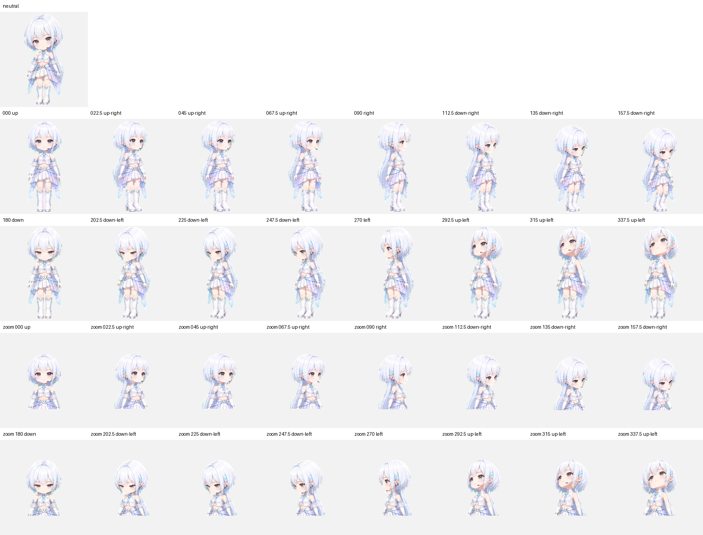

# QA and validation

The packaged atlas passed deterministic and independent visual checks.

## Deterministic checks

- Format: WebP, RGBA
- Dimensions: `1536 × 2288`
- Grid: `8 × 11`
- Cell size: `192 × 208`
- Sprite version: `2`
- Used cells: non-empty
- Unused cells: fully transparent
- Transparent RGB residue: `0` pixels
- Atlas validator errors: none
- Atlas validator warnings: none

See [`qa/validation.json`](../qa/validation.json).

## Direction checks

All sixteen look directions were reviewed semantically. Three isolated blind reviewers also classified seven horizontal and seven vertical A/B pairs without direction labels. Strict majority validation passed with:

- errors: none
- warnings: none
- unconfirmed pairs: none
- review required: false

Evidence is stored in:

- [`qa/direction-semantics.json`](../qa/direction-semantics.json)
- [`qa/direction-blind-validation.json`](../qa/direction-blind-validation.json)

## Visual review notes

- Identity, face, palette, headset, hair ornament, costume, proportions, and baseline remain consistent across all eleven rows.
- Direction cardinals are unmistakable: up, screen-right, down, and screen-left.
- Continuity metric outliers were inspected at normal pet size and did not produce visible reversals, scale pops, broken attachments, or discontinuities.
- Reported low-row alpha gaps are intentional negative space between the legs and boots, not transparent seams inside the character.

